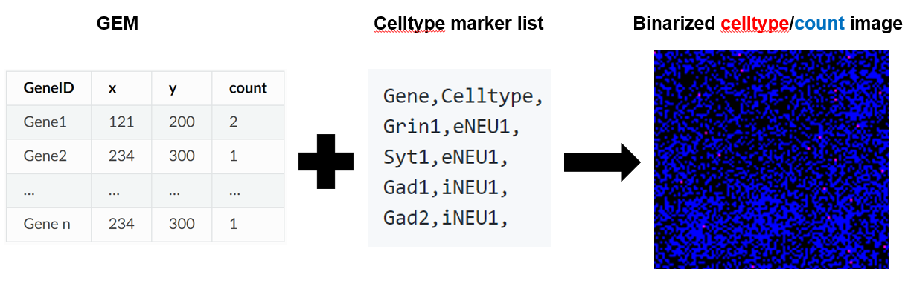

[](https://github.com/gaofan83/rust_stereo/releases)


### rust_stereo: a data processing pipeline to generate cell-type annotated spatial images from Stereo-seq nanoball(bin1) gene matrix
#####

#####
### Installation
1) Download the latest version from https://github.com/gaofan83/rust_stereo/releases to a Linux workstation
```
wget https://github.com/gaofan83/rust_stereo/releases/download/rust_stereo_v1.0/rust_stereo
chmod 755 rust_stereo
```

### USAGE
```
Command: rust_stereo --in input.tissue.gem.gz --marker marker_genes.csv --radius 100

USAGE:
    rust_stereo [OPTIONS]

FLAGS:
    -h, --help       Prints help information
    -V, --version    Prints version information

OPTIONS:
        --in <gemin>             Please input gem.gz file
        --marker <markerin>      cell type marker gene list
        --radius <radius_bin>    radius distance (bin) for neighbour selection

######################################################################################
```
#####
### Input format
##### GEM gene count matrix
| geneID | x   | y   | MIDCount | ExonCount |
|--------|-----|-----|----------|-----------|

##### Cell marker gene list (2 column csv file with each line ends with comma)
```
Gene,Celltype,
Grin1,eNEU1,
Syt1,eNEU1,
Gad1,iNEU1,
Gad2,iNEU1,
```
#####
### Output files
* xxx_celltypes_CELLTYPE1_UMI_full.png (Celltype annotated nanoball RGB images)
* xxx_cell_counts.txt Summary of celltype annotated nanoball counts
```
Celltype	Cell_count
eNEU3	41010
eNEU1	346492
iNEU1	106454
OLI	328810
```
* xxx_markers.gem (Gem file with nanoballs annotated by celltype)
```
geneID	x	y	MIDCount
eNEU1	8084	7126	1
iNEU1	10487	9614	1
eNEU2	12988	13954	1
iNEU1	9862	17309	1
```
* xxx_neighbours.txt (Nanoball neighbour counts) 
```
Center_celltype	Center_position	Radius	Surrounding_celltype	Cell_count
OLI	7801_18275	100	eNEU2	1
AST	13366_11421	100	eNEU2	1
AST	10589_7939	100	eNEU2	2
eNEU1	10687_14831	100	eNEU2	1
```

#####
### Demo run
#### 1) Download adult mouse brain Stereo-seq gem data file (445Mb size) from STOMICS Database 
`wget https://ftp.cngb.org/pub/SciRAID/stomics/STDS0000058/Bin1_matrix/Mouse_brain_Adult_GEM_bin1.tsv.gz`
##### Note: the latest Stereo-seq gem file has a different file extension that ends in gem.gz
#####
#### 2) Download marker_genes_5XFAD.csv from this repo https://github.com/gaofan83/rust_stereo/
##### Note: This list of mouse brain cell-type marker genes originated from the following paper:
##### [Human and mouse single-nucleus transcriptomics reveal TREM2-dependent and - independent cellular responses in Alzheimer’s disease, Nature Medicine 2020](https://www.nature.com/articles/s41591-019-0695-9/figures/1)
#####
#### 3) Run the following command to generate cell-type-specific image files and return statistics results
##### Result files can be downloaded from [Google Drive](https://drive.google.com/drive/folders/10LF7JoX_0CqqfQoR7xSZQqvL_9zIJA49?usp=sharing) 
```
./rust_stereo --in Mouse_brain_Adult_GEM_bin1.tsv.gz --marker marker_genes_5XFAD.csv --radius 100
```
#####
